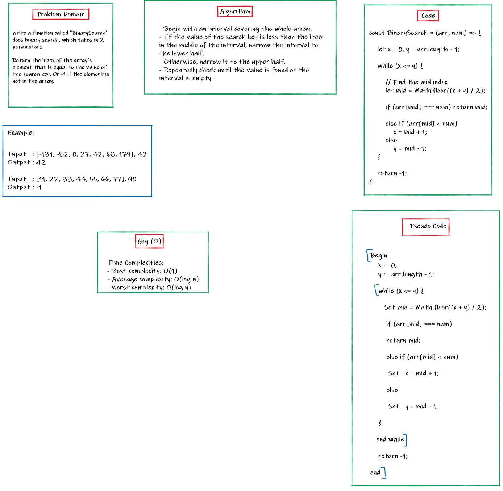

# Binary Search of Sorted Array

Write a function called `BinarySearch` which takes in 2 parameters: a sorted array and the search key. Without utilizing any of the built-in methods available, return the index of the array’s element that is equal to the value of the search key, or -1 if the element is not in the array.

## Whiteboard Process

## Approach & Efficiency

Binary Search Approach: Binary Search is a searching algorithm used in a sorted array by repeatedly dividing the search interval in half. The idea of binary search is to use the information that the array is sorted and reduce the time complexity to O(Log n).

Time Complexities:
- Best case complexity: `O(1)`
- Average case complexity: `O(log n)`
- Worst case complexity: `O(log n)`

### [Back to the HOME](../../../README.md)