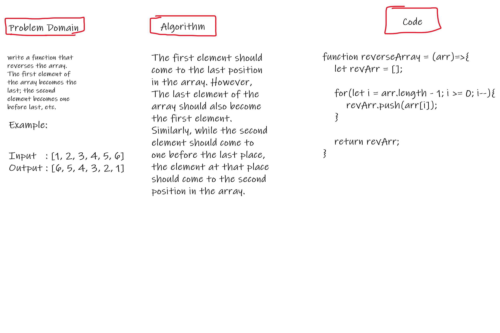

# Reverse an Array
Write a function called reverseArray which takes an array as an argument. Without utilizing any of the built-in methods available to your language, return an array with elements in reversed order.
## Whiteboard Process

## Approach & Efficiency

This method reverses the order of the array elements by modifying the existing array using for-loops and counting in order to arrange the array from end to beginning.