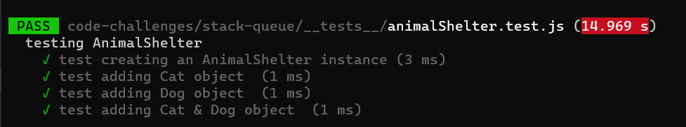

# Challenge Summary
The challange asked us to Create a class called AnimalShelter which holds only dogs and cats using a `first-in, first-out approach`

## Whiteboard Process

## Approach & Efficiency
we used the same method from previous challenges and same process so the time and complexity will remain the same which is BigO(1)

* BigO fo enqueue = O(1);
* BigO fo dequeue = O(1);

## Solution

